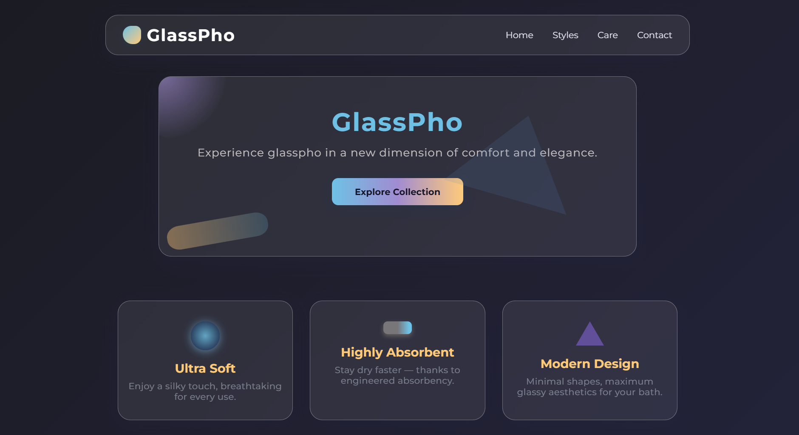

# GlassPho (PerplexityAI) 

"GlassPho" is an interface design project centered around the concept of glassmorphism—a modern visual style that mimics the look and feel of frosted glass on digital screens. The design achieves an elegant, premium look and depth through translucent elements, soft backgrounds, and subtle blur effects layered over vibrant backdrops.

## Live Project :  
https://AICOMp-sketch.github.io/GlassPho/Source%20Code